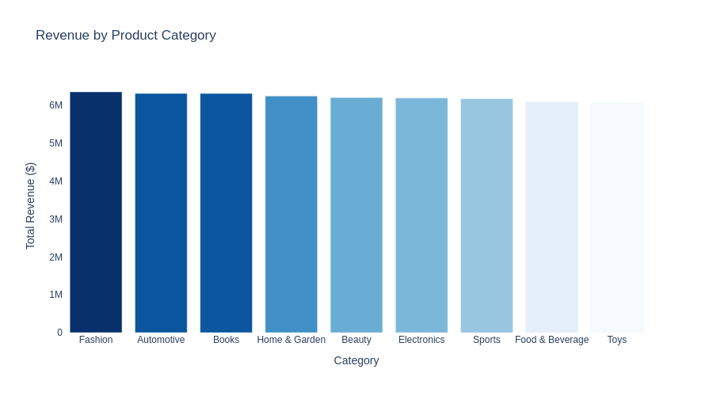
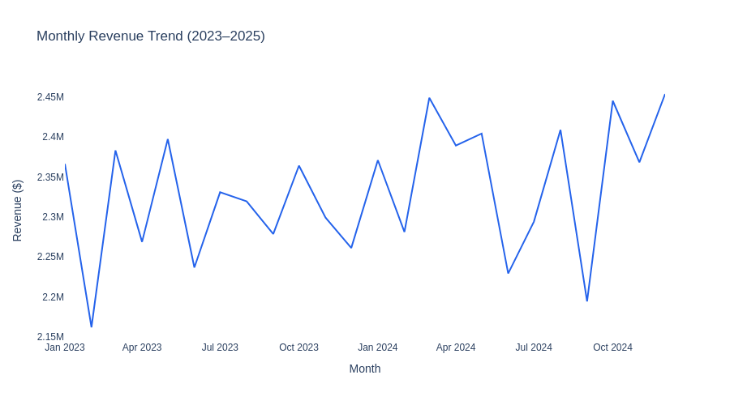
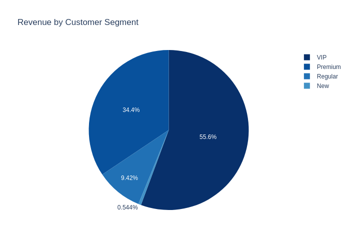

# ecommerce-medallion-pipeline

End-to-end data pipeline that moves 100k synthetic ecommerce orders through bronze → silver → gold. Built this to get hands-on with the patterns I keep seeing in data engineering job descriptions — incremental loading, dbt, Airflow, data quality checks.

---

## what it does

Raw orders come in with intentional problems: negative prices, missing return reasons, cancelled orders in the mix. The pipeline cleans them up, builds out revenue columns, and loads aggregated tables ready for reporting.

```
bronze_orders (100k raw rows)
       ↓  filter + enrich
silver_orders (~80k clean rows)
       ↓  dbt models
mart_daily_sales        → revenue KPIs by day
mart_category_metrics   → performance by product category
mart_customer_segments  → RFM: VIP / Premium / Regular / New
mart_city_metrics       → orders and revenue by city
```

The dbt layer re-models the gold logic as proper mart tables with schema tests baked in, so if the upstream silver data changes, the tests will catch it.

---

## stack

- **DuckDB** — local SQL warehouse, no server to manage
- **pandas** — data generation and silver transforms
- **dbt-duckdb** — mart models + schema tests
- **Apache Airflow** — daily DAG with retries
- **PySpark** — ran some of the analysis queries on silver to compare results
- **pytest** — 9 tests covering the full pipeline from bronze through gold
- **Plotly** — charts saved to images/

---

## numbers

- 100,000 orders in bronze
- 80,090 rows survive into silver (dropped ~20k cancelled/bad rows)
- $55.9M total revenue across 9 product categories
- 19,584 unique customers segmented by spend

---

## folder layout

```
ecommerce-medallion-pipeline/
├── pipeline/
│   ├── bronze.py           # synthetic data gen → DuckDB
│   ├── silver.py           # cleaning, revenue calcs, date features
│   ├── gold.py             # 4 aggregated tables
│   ├── quality_checks.py   # basic assertions after each run
│   └── run_pipeline.py     # runs all 4 steps in order
├── dbt_project/
│   ├── models/staging/     # stg_orders view on top of silver
│   └── models/marts/       # mart_daily_sales, mart_category_metrics,
│                           # mart_customer_segments, mart_city_metrics
├── dags/
│   └── ecommerce_dag.py    # Airflow DAG, runs daily
├── tests/
│   └── test_pipeline.py    # pytest, uses a temp test.db
└── images/
```

---

## charts

**revenue by category**


**monthly revenue trend**


**customer segment breakdown**


---

## how to run

```bash
git clone https://github.com/Shibin2000/ecommerce-medallion-pipeline
cd ecommerce-medallion-pipeline
pip install -r requirements.txt

# run the full pipeline
cd pipeline
python run_pipeline.py

# dbt models and tests
cd ../dbt_project
dbt run --profiles-dir .
dbt test --profiles-dir .

# pytest
cd ..
pytest tests/test_pipeline.py -v
```

---

## notes

**incremental loading** — bronze only appends rows where `order_date > MAX(order_date)` already in the table. Took a bit of fiddling to get the DuckDB date comparison working correctly when the table was empty on first run.

**RFM thresholds** — the $500/$1000/$2000 cutoffs are based on eyeballing the spend distribution. In a real project these would probably be percentile-based.

**dbt on DuckDB** — the `profiles.yml` points to the local `.db` file. If you move the db file, update the path in `dbt_project/profiles.yml`.
